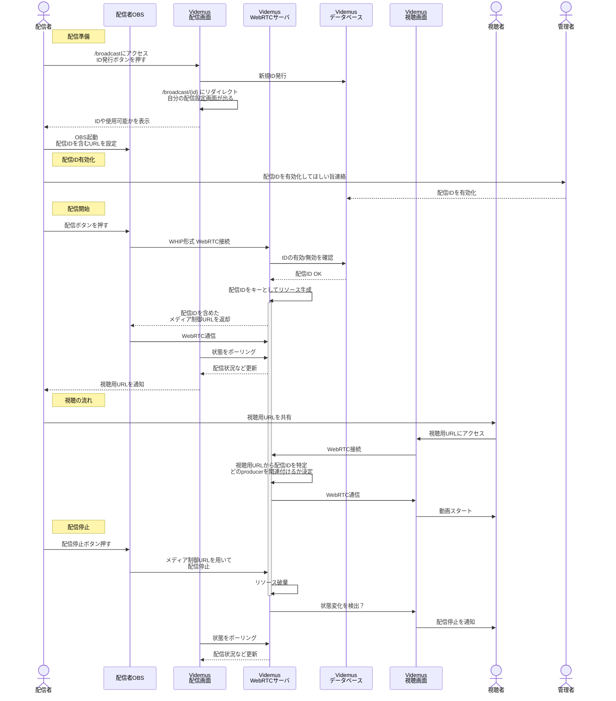

# Videmus 開発メモ

## 配信IDと視聴URLの管理方法検討
毎回異なる配信URLをOBSに設定するのは、
セキュリティの観点からはよさそうだが面倒な気がする。

配信者毎に決まったIDを（基本的に）固定で割り当てておきたい。

OAuthを使った管理をすれば利用者を増やしてもいけるが、
身内だけで使うならID発行→有効化する際に最初の何文字か教えてもらって
手動で有効化、という方法が楽そう。

