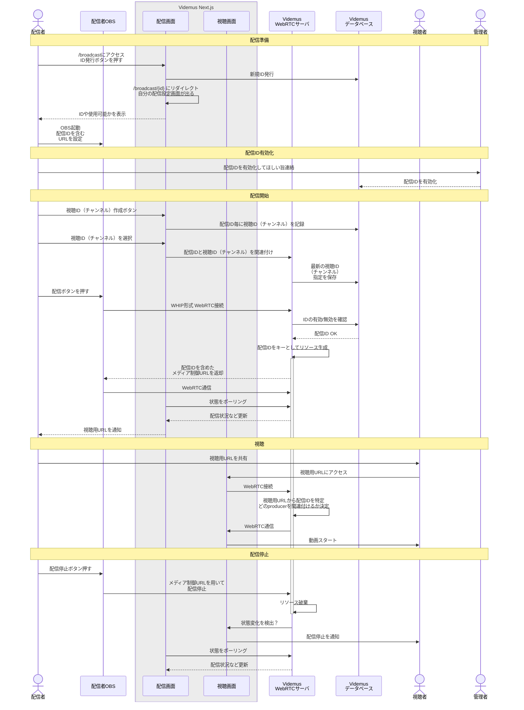
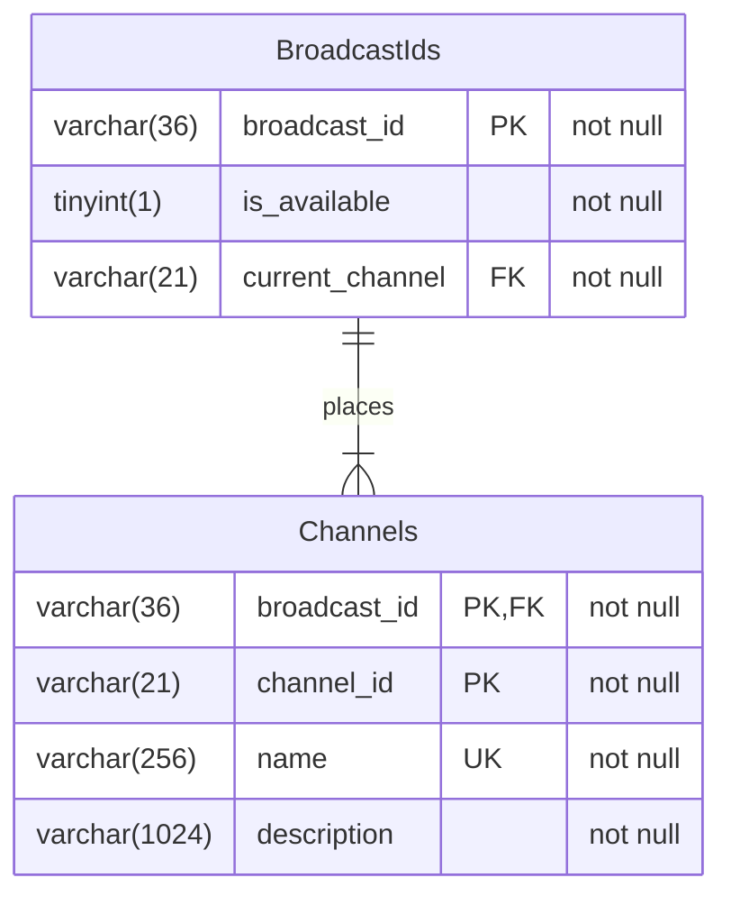
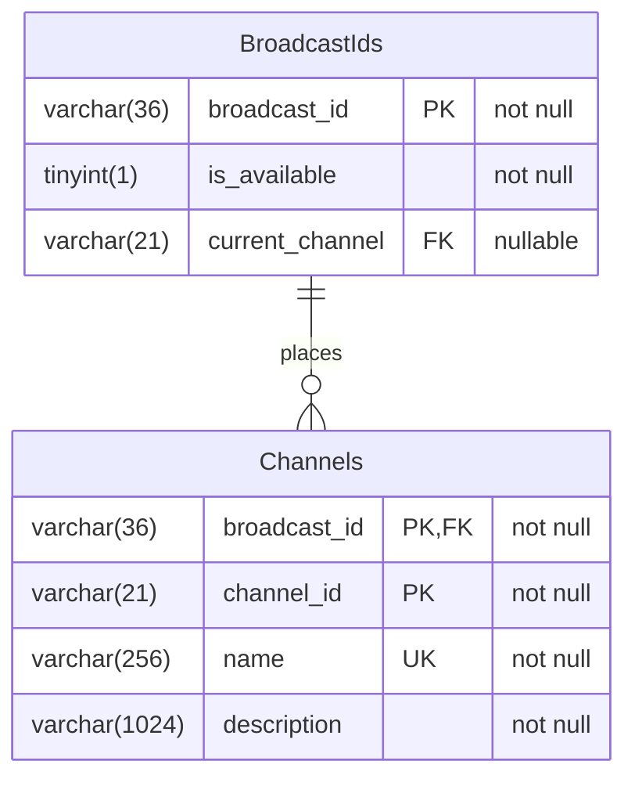

# Videmus 開発メモ


## 配信IDと視聴URLの管理方法検討

### 2024-10-31
デモ動作を行った際、OBSが（恐らくフレームレート低下のため）
切断・再接続を行い、視聴用URLがリセットされる現象が明らかになりました。

ホラー系を同一の視聴用URLで使いまわして配信した際、
誤視聴（？）したユーザが心臓発作を起こさないか心配です。

そこで毎回視聴用URLをリセットするのでなく、
Videmus側に配信チャンネルの概念を設けて視聴用URLを管理するのが良さそう。

ただし、OBSに異なるURLやBearerトークンを渡してチャンネルを切り替えるか、
Videmusの配信画面からチャンネルを操作するのか選択肢が有りそう

前者の方が普通そうではあるが...
1人の配信者が同時に1配信しか出来ないという仮定をしてしまえば、
（それほど理不尽な仮定ではなさそう？）
現在配信しているのはどのチャンネル向けか？という設定さえすればよくなる。

これは現在の実装なら比較的簡単に実現できるかも...
```typescript
resourcesDict: { [broadcastId: string]: {
  router: Router;
  streamId: string;
  broadcasterResource: BroadcasterResource;
  streamerResources: StreamerResources[];
}}
```
といった感じなので、配信中だったとしてもstreamIdを変更してチャンネル切り替えが出来る。
その場合、既に視聴していたクライアントは基本的に視聴を継続できる！
もしかしたら便利かも。
（streamIdはmediasoup <-> mediasoup-client間の接続確立のためのIDに過ぎないので）

ただし、クライアント側で再接続する処理を実装する際には
変更後のチャンネルが分からないと流石に接続できない。

この仕組みを実現するには、
- 配信ID毎にチャンネルの情報をデータベースに記録
- 配信用画面でチャンネルの追加・編集・削除と選択が出来る様にする

...ことが必要になる。できそう。


### 最初の検討
毎回異なる配信URLをOBSに設定するのは、
セキュリティの観点からはよさそうだが面倒な気がする。

配信者毎に決まったIDを（基本的に）固定で割り当てておきたい。

OAuthを使った管理をすれば利用者を増やしてもいけるが、
身内だけで使うならID発行→有効化する際に最初の何文字か教えてもらって
手動で有効化、という方法が楽そう。


## 配信フロー検討


## データベース構成検討
### 理想の場合

### MySQLで扱う場合の現実的なライン
deferred constraintが無いため、アプリケーション側で
braodcast\_id毎に "運用上では" nullでないcurrent\_channel\_idが
入る様にする



## データベース操作検討
BroadcastIdsテーブルとChannelsテーブルはお互いに外部キーを持ち、
not null制約を課しています

これは新しいエントリを作成する場合に、両方を同時に行うことが
必要になる場合が有ります

新しいBroadcastIdsエントリを追加する際には、
これから追加するbroadcast\_idと関連付けられた最低1つの
Channelsエントリを同時に追加する必要があります

### 2つのテーブルが相互に外部参照する場合
データ挿入時にはdeferred constraintが必要になりそうです。
ですがこれはMySQLにはないため、他のデータベースを使う必要があります。

一旦データベース側の制約を緩め、代わりにアプリケーションで対応する方が
適切な場面かもしれません。

BroadcastIdsを一旦current\_channel=NULLでエントリを追加して、
次にChannelsエントリに新しいチャンネルを設定し、
最後にBroadcastIdsのcurren\_channelを先ほど作ったchannelのものにします

適宜BroadcastIdsのcurrent\_channelは使用する際にNULLかどうか
毎回チェックするようにし、その場合にはデフォルト値
（最初に登録されたチャンネル等）を入れるようにします。

チャンネルが消去される際に、あまりに厳密な外部参照を設定すると
処理方法がややこしくなりそうです...
やはりアプリケーション側で担保しようと思います

