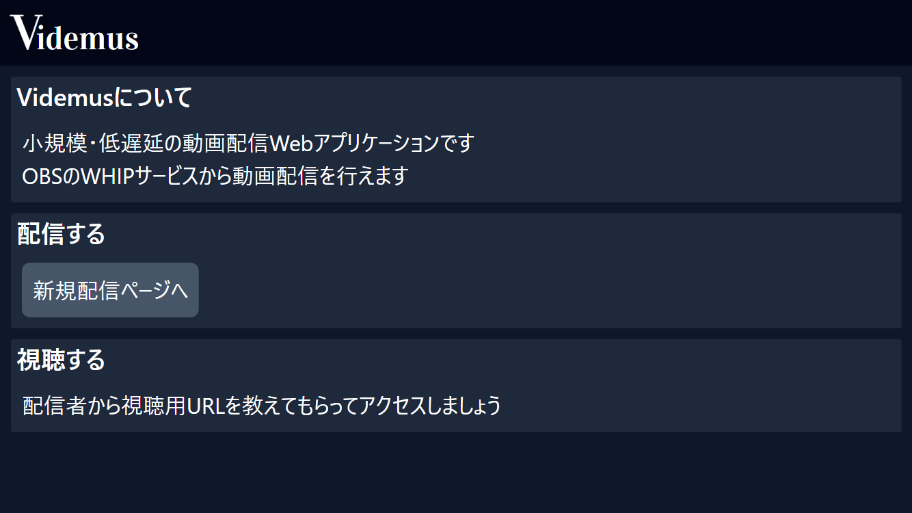
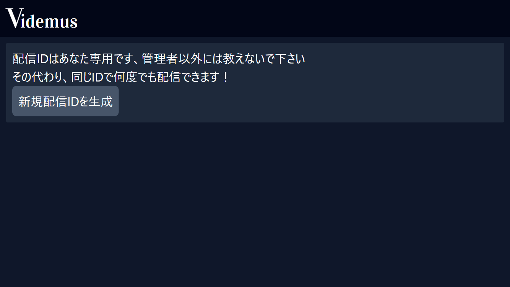
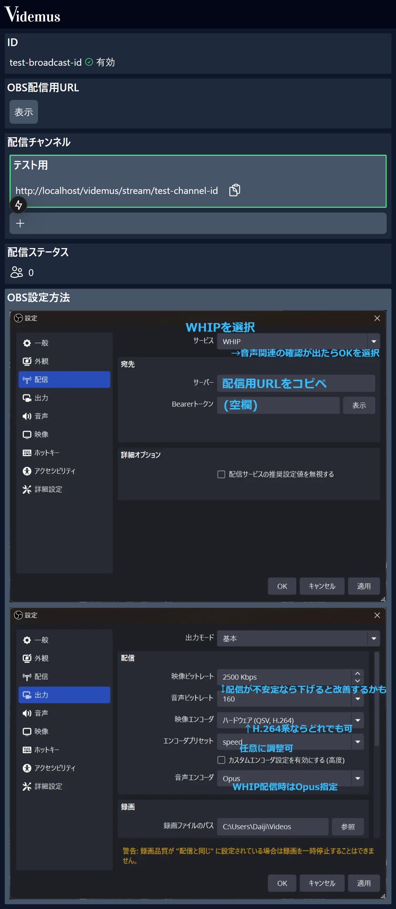

# 小規模・低遅延動画配信サーバ/クライアント videmus

[mediasoup](https://mediasoup.org/) を用いた、
少人数でのゲーム画面配信を目的とした
動画配信・視聴Webアプリケーションです。

## 使用方法
videmusが`https://videmus.example.com`に配置されているとして
使用方法を説明します

`https://videmus.example.com` にアクセスすれば
簡易的な説明付に従って配信・視聴できます

### 配信方法
#### 配信ID発行
`https://videmus.example.com/broadcast` は、新しい配信者として
登録するための画面です



「新規配信IDを生成」ボタンを押します。

配信用IDが無効状態で発行され、 配信管理用ページに遷移します


> [!IMPORTANT]
> 配信用IDは管理者を除く他の人には秘密にするか、少人数でのみ共有して下さい
>
> これはVidemusにおけるあなたの身分証で、
> 第三者に知られた場合、配信を乗っ取られてしまいます

#### 配信管理用ページ
配信管理用ページは `https://videmus.example.com/broadcast/<配信用ID>` にあります。
ここでは配信・視聴状況の確認と設定を行うことが出来ます。



配信を行うために、管理者と連絡を取って配信IDを伝え、 有効化する様に伝えてみて下さい。
（全文字でなく、最初の5~6文字でも十分に伝わります）

管理者は伝えられたIDについて、
`BroadcastIds` テーブルの `is_available` 列を
`0` から `1` に書き換えて有効化します
（現在のところは直接データベース内の該当行を編集します）

OBS配信設定もこのページに一緒に示されています。

スクリーンショットの設定に従ってOBSで配信を開始しましょう。

配信管理用ページで視聴用URLがコピーできますので、
それを視聴者に伝えれば、配信者の準備は完了です。

### 視聴方法
配信者から伝えられた視聴用URLにアクセスします。


## テスト環境起動方法
1. Gitリポジトリをクローン
2. プロジェクトディレクトリ内で `pnpm install` を実行
   (mediasoupなどbuildの許可を要求された場合には許可してください)
2. 以下の環境変数ファイルをテスト環境に合わせて記述します
   - ```env:.env.database
     DB_HOST=database
     MYSQL_USER=<任意のデータベースユーザ名>
     MYSQL_PASSWORD=<任意のデータベースパスワード>
     MYSQL_DATABASE=<任意のvidemusデータベース名>
     MYSQL_ROOT_PASSWORD=<任意のMySQLルートパスワード>
     TEST_BROADCAST_ID=<試験用に初めから有効にする配信用ID文字列>
     TEST_CHANNEL_ID=<試験用に初めから有効にするチャンネルID文字列>
     ```
   - ```env:.env.next
     NEXT_PUBLIC_HOST_URL=<テスト環境のVidemus Next.jsページURL>
     HOST_URL=<テスト環境のVidemus Next.jsページURL（同じでOK）>
     ```
   - ```env:.env.webrtc
     ANNOUNCED_IP=<テスト環境のIPアドレス>
     HOST_URL=<テスト環境のVidemus Next.jsページURL>
     ```
3. `docker compose up` コマンドを実行すると、
   一連のコンテナが立ち上がり開発環境で動作確認が出来ます

## 配置方法
### Videmus 本番環境Dockerイメージのビルド
次のコマンドでVidemus Next.jsイメージと
Videmus WebRTCサーバイメージをビルドします

`docker build -e NEXT\_PUBLIC\_HOST\_URL=<本番環境のVidemus Next.jsのURL> -t <任意のVidemus Next.jsイメージ名> -f ./next/Dockerfile.nextjs.prod .`
> [!IMPORTANT]
> Next.jsはNEXT_PUBLIC_から始まる環境変数をビルド時に
> 埋め込むので、この時点で指定します
>
> 他の環境変数は本番環境のdocker-compose.ymlなどで指定できます

`docker build -t <任意のVidemus WebRTCサーバイメージ名> -f ./webrtc/Dockerfile.webrtc.prod .`


> 

これらのイメージを一度プライベートDocker Hubレジストリ等に
`docker push`する等して送信し、本番環境で使用する準備をします

本番環境用にdocker-compose.ymlを作成し、
`docker compose up -d`コマンドなどで実行できます

### 配置時の注意
videmus-webrtcコンテナをパフォーマンスのため`network\_mode: host` で運用します。
ポート指定や他のコンテナとの相互運用、ホスト側のファイアウォール設定など
注意する必要があります。
